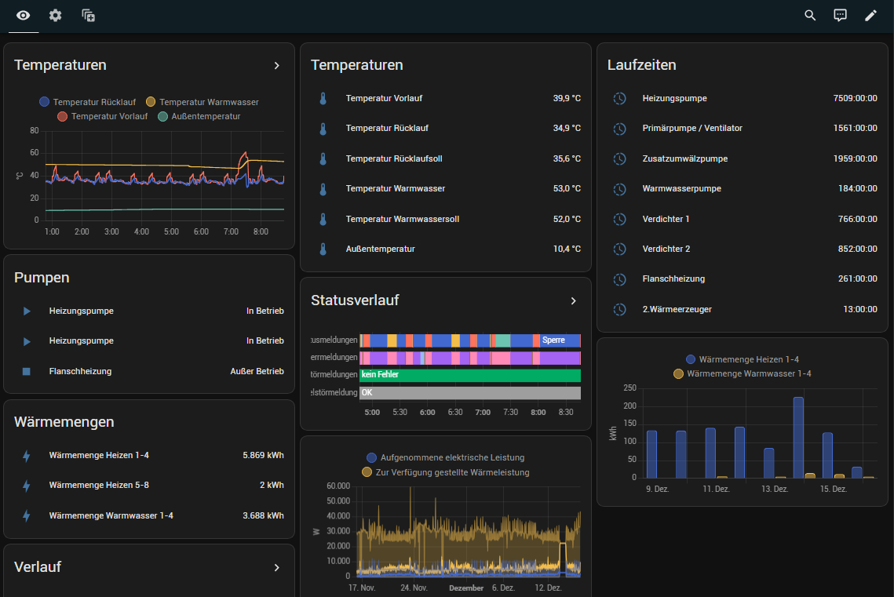
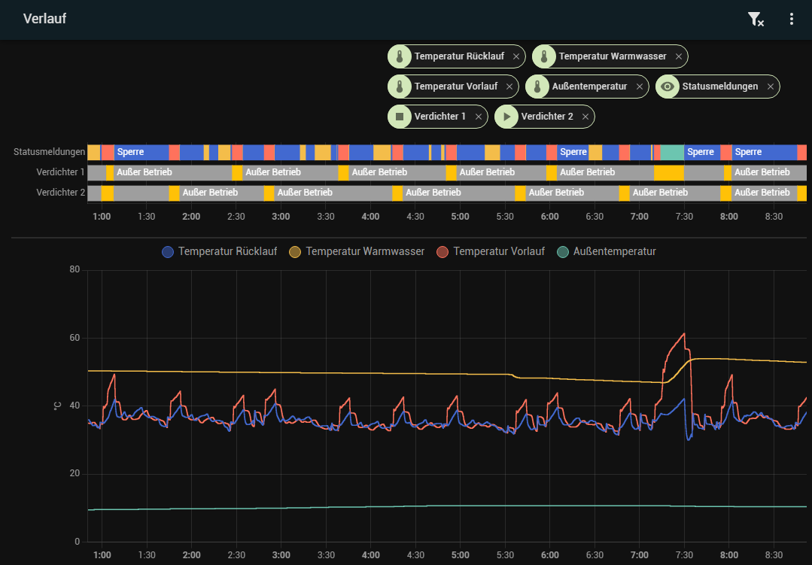
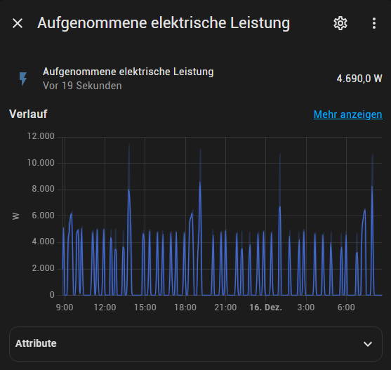
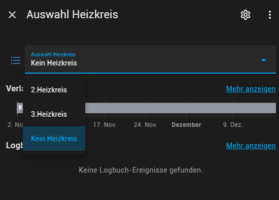

= mobugen
:toc:

A generator for Modbus configuration files

== Overview
This project provides a generic facility to create configuration files for Modbus devices. Main purpose is the integration of Modbus devices into Smart Home platforms without dependency on a particular device, platform or protocol.

[source, mermaid]
....
flowchart LR
    modbus[("Modbus<br/>Definitions")] --> g(Generator)
    g -->x[(Configuration)]
....

There are no restrictions on the format or content of the configuration files, so in theory it is possible to support any target system.

As <<Proof of Concept, proof of concept>>, a Buderus heat pump was integrated into Home Assistant.

.Integration of a Buderus heat pump in Home Assistant
====

====

== Quick start
. Download or create Modbus definitions (CSV format).
. Run generators.
. Copy or merge config.

=== Example
Generate configuration for MQMGateway and Home Assistant, targeting a Dimplex system with version M3.13:

```sh
$ ls data/dimplex-rtu
enums.csv  registers.csv

$ docker run --rm -v "$PWD/data/dimplex-rtu:/opt/mobugen/data:ro" ghcr.io/git-developer/mobugen mqm-gojq-generator M3.13 >mqmgateway/config.mqtt-devices.yaml

$ docker run --rm -v "$PWD/data/dimplex-rtu:/opt/mobugen/data:ro" ghcr.io/git-developer/mobugen ha-mqtt-gojq-generator M3.13 >home-assistant/config/packages/mqtt.yaml
```

== Purpose of this project

=== Main Goals

. Provide a format to describe Modbus devices in a generic, open and machine-readable format.
. Provide generators that transform this description into a configuration for arbitrary Modbus consumers.

=== Design decisions

Initial motivation for this project was the need to monitor a Buderus heat pump. It was disappointing to find out that the options offered by the vendor are proprietary, cloud-based and expensive - 3x No-Go. Further analysis revealed that the heat pump was labelled Buderus but actually contains components from Dimplex. So the focus was now to **monitor a Dimplex heat pump**.

Fortunately, there are several options in both hard- and software, and https://dimplex.atlassian.net/wiki/spaces/DW/pages/2862481429/Modbus+RTU+Anbindung[comprehensive documentation] offered by the manufacturer. A good match in terms of being open, cloud-free and cheap is **Modbus RTU**.

There seems to be no ready-to-use Dimplex/Modbus integration in any of the major Smart Home platforms. This means it takes some time to build a configuration, no matter how. The most obvious option would be to create a configuration for a popular Smart Home system manually. This approach has some downsides, though:

. It's not easy to switch to a different Smart Home platform in the future. The configuration has to be done again, in a different syntax.
. Modbus is designed with a single master in mind, so it's not possible to connect multiple systems in parallel. This complicates migration from one system to another.
. Configuration via browser is time-consuming, and there's usually no history for changes. Writing a text-based (e.g. YAML) configuration by hand is time-consuming and cumbersome.

Downsides #1 and #2 can be resolved by a **Modbus-to-MQTT gateway**. The gateway is connected to devices via Modbus and allows one or more MQTT-capable systems to communicate with the devices. There are plenty of solutions available, in both hard- and software.

The last downside can be addressed by generating the configuration from a description that is device-based and independent of a Smart Home system. A simple, user-editable and machine-readable format is the good old **CSV** format. The final missing piece is a **generator** for the configuration of the gateway and the Smart Home system. 


== Usage
=== General instructions
To make use of this project, you need at least

- A Modbus device with register infos
- A linux host with a container runtime (e.g. a PC, Raspberry Pi or NAS running Docker)
- A smart home system using a text-based configuration (e.g. Home Assistant or FHEM)

You can then

. Transfer the Modbus register info of your device into the CSV format explained in <<Modbus definitions>>.
. Pick an existing generator or <<Development, implement a new one>>.
. Run the generator to create a configuration file.
. Merge the configuration file with your existing configuration.

[source, mermaid]
....
flowchart TD
    subgraph modbus[Modbus Definitions]
        r[(registers.csv)]
        e[(enums.csv)]
    end
    subgraph home-assistant[Home Assistant]
        g2 --> h[home-assistant/<br/>config/<br/>packages/<br/>mqtt.yaml]
    end
    subgraph mqmgateway[MQMGateway]
        g1 --> m[mqmgateway/config.yaml]
    end
    modbus --> g1{mqm-gojq-generator}
    modbus --> g2{ha-mqtt-gojq-generator}
....

=== Modbus definitions
As part of this project, Modbus definitions for Dimplex RTU have been taken from the official https://dimplex.atlassian.net/wiki/spaces/DW/overview[Dimplex Wiki], revised and consolidated to a machine-readable CSV format. They are split into one file for registers and another file for enumerations.

Both files contain a column `since` for the software version when a register was introduced. The value format is defined by Dimplex, allowed values match _<letter><number>.<number>_ where the numbers are optional. Example values are `M`, `M3` and `M3.13`.

Each generator implementation may decide on its own which columns are actually used.

==== Registers
[%header,format=csv]
|===
type,address,name,since,access,data_type,min,max,unit,class,conversion,scale,offset,domain,device,part,variable,category_id,category,subcategory
...,,,,,,,,,,,,,,,,,,,
Holding,2,Temperatur Rücklauf,J,R,int16,,,°C,,,0.1,,heating,,R2,E_Rueckl_T,1.3,Betriebsdaten,
Holding,14,Statusmeldungen,H,R,uint16,0,30,,operation,enum,,,,,,Anz_Status_Wert,1.1,Systemstatus,
Holding,43,Statusmeldungen,J,R,uint16,0,30,,operation,enum,,,,,,Anz_Status_Wert,1.1,Systemstatus,
...,,,,,,,,,,,,,,,,,,,
|===

Remarks:

- The combination of `type`, `address` and `since` is unique.
- When the value of `conversion` starts with `enum`, values are taken from the enumeration definitions. By default, the enum name is derived from the register name. A custom enum name may be set using the syntax `enum:custom_name`.
- `class`, `domain` and `device` have been added to allow a detailed representation of a register in Smart Home systems. `category_id` was added to retain the original order and structure. All other columns have been taken over from the wiki.

==== Enumerations
[%header,format=csv]
|===
register_type,name,since,value,description,part
...,,,,,
Holding,Statusmeldungen,L,0,Kein Status,
Holding,Statusmeldungen,L,1,Aus,
...,,,,,
Holding,Statusmeldungen,H,0,Aus,
Holding,Statusmeldungen,H,1,Wärmepumpe Ein Heizen,
...,,,,,
|===

Remarks:

- The combination of `register_type`, `name` and `since` is unique.
- `name` usually matches a register name, but this is not required.

=== Generators
This project provides 2 generators that work together. They may be configured using environment variables.

.Common environment variables
[cols="1,3,1"]
|===
| Variable
| Description
| Default

| `MQTT_TOPIC_PREFIX`
| A prefix for the MQTT topic
| _none_

| `MQTT_TOPIC_PARTS`
| Comma-separated list of properties that are used as MQTT topic segments
| `category,subcategory,domain,device,part,name`
|===

==== MQMGateway
`mqm-gojq-generator` outputs a MQTT configuration for https://github.com/BlackZork/mqmgateway/[MQMGateway], a gateway between Modbus and MQTT. With that config, your Modbus device is exposed via MQTT for read and write access. MQMGateway allows to periodically poll multiple registers at once efficiently, and to publish state changes via MQTT. Changing register values via MQTT is supported, too.

.Environment variables
[cols="1,3,1"]
|===
| Variable
| Description
| Default

| `MQM_ADDRESS_OFFSET`
| Address offset (integer)
| `0`

| `MQM_NETWORK`
|  MQMGateway name of the Modbus network the registers belong to
| `network`

| `MQM_SLAVE_ADDRESS`
| Modbus slave address the registers belong to
| `1`
|===

==== Home Assistant
`ha-mqtt-gojq-generator` outputs a MQTT configuration for https://www.home-assistant.io/[Home Assistant], exposing a properly configured entity for each Modbus register and referencing the topics provided by MQMGateway. Each entity is classified according to the Modbus definition (e.g. platform, category, custom attributes) so that Home Assistant knows how to represent it properly.

[cols="1,3,1"]
|===
| Variable
| Description
| Default

| `HA_DEVICE_ID`
| Id of a device that entities are associated with
| _none_

| `HA_CUSTOM_ATTRIBUTES`
| A comma-separated list of property names for custom attributes
| `category,subcategory,domain,device,part`

|===

=== Examples
.Excerpt from a register definition file `registers.csv`
[%header,format=csv]
|===
type,address,name,since,access,data_type,min,max,unit,class,conversion,scale,offset,domain,device,part,variable,category_id,category,subcategory
Coil,50,Flanschheizung,J,R,boolean,,,,operation,,,,tapwater,flange,E9,A_FH,1.7,Ausgänge,
Holding,377,Aufgenommene elektrische Leistung,M3.5,R,uint16,-32768,32767,W,electricity,,0.1,,,,,Leist_Elekt,2.2.2,Energiemanagementsysteme,Leistungen und Überschuss
Holding,289,Auswahl Heizkreis,,RW,uint16,2,3,,option,enum,,,heating,,,HK_Wert,1.9.1,Einstellungen 2./3. Heiz-/Kühlkreis,
|===

.Excerpt from an enum definition file `enums.csv`
[%header,format=csv]
|===
register_type,name,since,value,description,part
Holding,Auswahl Heizkreis,,0,Kein Heizkreis,
Holding,Auswahl Heizkreis,,2,2.Heizkreis,
Holding,Auswahl Heizkreis,,3,3.Heizkreis,
|===

.Excerpt from a generated MQMGateway configuration
====
```sh
$ docker run --rm -v "$PWD:/opt/mobugen/data:ro" -e MQTT_TOPIC_PREFIX=heatpump -e MQM_ADDRESS_OFFSET=1 ghcr.io/git-developer/mobugen mqm-gojq-generator M3.13
```
```yaml
mqtt:
  objects:
    - state:
        name: state
        register: network.1.51
        register_type: coil
      topic: heatpump/ausgaenge/tapwater/flange/e9/flanschheizung
    - state:
        converter: expr.evaluate("R0 * 0.1", 1)
        name: state
        register: network.1.378
      topic: heatpump/energiemanagementsysteme/leistungen-und-ueberschuss/aufgenommene-elektrische-leistung
    - command:
        converter: std.map('0:"Kein Heizkreis",2:"2.Heizkreis",3:"3.Heizkreis"')
        name: set
        register: network.1.290
        register_type: holding
      state:
        converter: std.map('0:"Kein Heizkreis",2:"2.Heizkreis",3:"3.Heizkreis"')
        name: state
        register: network.1.290
      topic: heatpump/einstellungen-2-3-heiz-kuehlkreis/heating/auswahl-heizkreis
```
====

.Excerpt from a generated Home Assistant configuration
====
```sh
$ docker run --rm -v "$PWD:/opt/mobugen/data:ro" -e MQTT_TOPIC_PREFIX=heatpump -e HA_DEVICE_ID=wlw286 ghcr.io/git-developer/mobugen ha-mqtt-gojq-generator M3.13
```
```yaml
mqtt:
  - binary_sensor:
      entity_category: 'diagnostic'
      name: 'Flanschheizung'
      object_id: 'heatpump_ausgaenge_tapwater_flange_e9_flanschheizung'
      unique_id: 'heatpump_ausgaenge_tapwater_flange_e9_flanschheizung'
      device_class: 'running'
      device:
        identifiers:
          - 'wlw286'
      json_attributes_template: '{"domain":"tapwater","device":"flange","part":"E9"}'
      json_attributes_topic: 'heatpump/ausgaenge/tapwater/flange/e9/flanschheizung'
      state_topic: 'heatpump/ausgaenge/tapwater/flange/e9/flanschheizung/state'
      value_template: '{{ value_json.state }}'
      payload_off: 0
      payload_on: 1
  - sensor:
      entity_category: 'diagnostic'
      name: 'Aufgenommene elektrische Leistung'
      object_id: 'heatpump_energiemanagementsysteme_leistungen_und_ueberschuss_aufgenommene_elektrische_leistung'
      unique_id: 'heatpump_energiemanagementsysteme_leistungen_und_ueberschuss_aufgenommene_elektrische_leistung'
      device_class: 'power'
      device:
        identifiers:
          - 'wlw286'
      json_attributes_template: '{}'
      json_attributes_topic: 'heatpump/energiemanagementsysteme/leistungen-und-ueberschuss/aufgenommene-elektrische-leistung'
      state_topic: 'heatpump/energiemanagementsysteme/leistungen-und-ueberschuss/aufgenommene-elektrische-leistung/state'
      value_template: '{{ value_json.state }}'
      state_class: 'measurement'
      unit_of_measurement: 'W'
  - select:
      entity_category: 'config'
      name: 'Auswahl Heizkreis'
      object_id: 'heatpump_einstellungen_2_3_heiz_kuehlkreis_heating_auswahl_heizkreis'
      unique_id: 'heatpump_einstellungen_2_3_heiz_kuehlkreis_heating_auswahl_heizkreis'
      device:
        identifiers:
          - 'wlw286'
      json_attributes_template: '{"domain":"heating"}'
      json_attributes_topic: 'heatpump/einstellungen-2-3-heiz-kuehlkreis/heating/auswahl-heizkreis'
      command_topic: 'heatpump/einstellungen-2-3-heiz-kuehlkreis/heating/auswahl-heizkreis/set'
      state_topic: 'heatpump/einstellungen-2-3-heiz-kuehlkreis/heating/auswahl-heizkreis/state'
      value_template: '{{ value_json.state }}'
      options:
        - '2.Heizkreis'
        - '3.Heizkreis'
        - 'Kein Heizkreis'
homeassistant:
  customize:
    binary_sensor.heatpump_ausgaenge_tapwater_flange_e9_flanschheizung:
      friendly_name: 'Flanschheizung'
      part: 'E9'
      domain: 'tapwater'
      device: 'flange'
      category: 'Ausgänge'
    sensor.heatpump_energiemanagementsysteme_leistungen_und_ueberschuss_aufgenommene_elektrische_leistung:
      friendly_name: 'Aufgenommene elektrische Leistung'
      category: 'Energiemanagementsysteme'
      subcategory: 'Leistungen und Überschuss'
    select.heatpump_einstellungen_2_3_heiz_kuehlkreis_heating_auswahl_heizkreis:
      friendly_name: 'Auswahl Heizkreis'
      domain: 'heating'
      category: 'Einstellungen 2./3. Heiz-/Kühlkreis'
```
====

.Home Assistant: Overview
====

====
.Home Assistant: Status and Temperatures over time
====

====
.Home Assistant: Power Consumption
====

====
.Home Assistant: Select Control
====

====

== Proof of Concept

This section describes how the heat pump _Buderus WLW286 A_ was integrated in Home Assistant via MQTT.

[source, mermaid]
....
flowchart LR
    wpm["Buderus<br/>WPM100"]
    gw[<a href="https://github.com/budulinek/arduino-modbus-rtu-tcp-gateway">RTU to TCP<br/>Gateway</a>]
    mqm[<a href="https://github.com/BlackZork/mqmgateway/">MQM Gateway</a>]
    ha[<a href="https://www.home-assistant.io/">Home Assistant</a>]
    lwpm[<a href="https://dimplex.atlassian.net/wiki/spaces/DW/pages/2862481429/Modbus+RTU+Anbindung">Dimplex<br/>LWPM 410</a>]
    pcos[<a href="https://www.carel.com/product/rs485-card">Carel<br/>PCOS004850</a>]

    subgraph rtu[Modbus RTU Adapter]
        split{" "}
        merge{" "}
        split --> lwpm
        split --> pcos
        lwpm --> merge
        pcos --> merge
    end

    wpm --> split
    merge -->|Modbus RTU| gw
    gw -->|Modbus TCP| mqm
    mqm -->|MQTT| ha
....

This setup consists of:

. The heat pump _Buderus WLW286 A_ (Dimplex-based), controlled by a _WPM100_.
. A Modbus RTU adapter card.
+
Depending on the heat pump model, there might be different cards available, e.g. https://dimplex.atlassian.net/wiki/spaces/DW/pages/2862481429/Modbus+RTU+Anbindung[Dimplex LWPM 410] or https://www.carel.com/product/rs485-card[Carel PCOS004850] (~ 50€ to 130€).
. A Modbus RTU to TCP gateway.
+
A gateway allows to omit a direct cable connection between the heat pump and the smart home system. There are a lot of different devices available, including https://github.com/budulinek/arduino-modbus-rtu-tcp-gateway[DIY solutions] (e.g. Arduino + LAN + RS485, ~20€).
. MQMGateway, a software that adapts between Modbus (RTU or TCP) and MQTT.
. Home Assistant, a popular Smart Home system.

This setup has been implemented and tested. 

[NOTE]
.Possible variations
====
. Use a Modbus TCP card (e.g. Dimplex NWPM Touch) instead of the RTU card and the gateway. These are usually more expensive (~450€). Consequence: If the Modbus addresses differ between RTU und TCP, the Modbus definitions have to be modified.
. Use the Home Assistant Modbus integration, omitting MQMGateway. This simplifies the setup, on the other hand making it harder to swap the Smart Home System. Consequence: A generator for the Home Assistant Modbus integration is required.
. Use a different Smart Home system like FHEM or ioBroker. Consequence: A generator for the target system is required.
====

== Development
Generators are implemented as https://jqlang.github.io/jq/manual/[jq] filters, started by a shell script.

=== How to add a generator
To add a generator named `foo`:

. Create a symlink `bin/foo-gojq-generator` pointing to `bin/gojq-generator`.
. Create a JQ filter `jq/foo.jq` containing its name and a function `config` with arguments for the target version and the enum definitions:
+
```jq
module { "name": "foo" };

def config($version; $enumlist):
  # implementation
;
```

=== Runtime behavior
[source, mermaid]
....
flowchart LR
    csv[("Modbus<br/>Definitions<br/>(CSV)")]
    in[("Modbus<br/>Definitions<br/>(JSON)")]
    out[("Configuration<br/>(JSON)")]
    yaml[("Configuration<br/>(YAML)")]
    f1[Filter:<br/>CSV to JSON]
    f3[JSON to YAML]
    csv --> f1
    f3 --> yaml
    subgraph chain[jq]
        direction LR
        f1 --> in --> f2 --> out --> f3
    end
    subgraph f2[Transformation]
        direction LR
        t1[mqmgateway]
        t2[Home Assistant]
        t3[...]
    end
....

When the generator is run:

. The CSV files `registers.csv` and `enums.csv` are transformed to JSON (see `jq/csv.jq` for details).
. Register definitions are piped into the generator, the target version and enum definitions are given as arguments to `config`.
. The JSON output of the generator is transformed to YAML (using a feature of the JQ implementation `gojq`).

=== Hints
- You can mount your files into a container using volume mounts, e.g. `-v "$PWD/jq/foo.jq:/opt/mobugen/jq/foo.jq"`.
- Existing filters may be reused, see the files in directory `jq/` for details.

== References
- https://dimplex.atlassian.net/wiki/spaces/DW/overview[Dimplex Wiki]
- https://jqlang.github.io/jq/manual/[jq]
- https://www.home-assistant.io/[Home Assistant]
- https://github.com/BlackZork/mqmgateway[mqmgateway]
- https://github.com/john30/ebusd[ebusd]
- https://github.com/emsesp/EMS-ESP32/discussions/1710[EMS-ESP32: Buderus WPM100]
